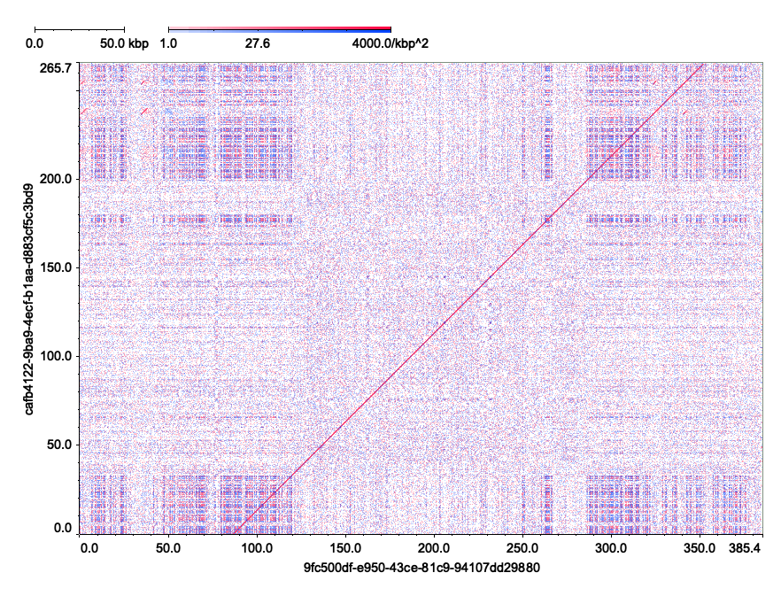

# tenten -- Dotplotter on top of minimap2

**tenten** is a tool to draw dotplots of DNA sequences, using matches from the output of minimap2's debug option `--print-seeds`. It internally calls minimap2 and parses its output. The options given to minimap2 can be controlled from tenten, allowing you to specify minimizer lengths and seed filtering parameters. It can be useful as a lightweight and fast dotplotter using minimizers, as well as a debugging tool to investigate the seeds that underlie the alignments reported by minimap2.



**Figure 1.** Dotplot of two reads from [HG002 high-accuracy ultra-long reads](https://epi2me.nanoporetech.com/gm24385_ncm23_preview/). Plotted with `tenten -b500 --font-size=18 -P "minimap2 -t1 -xmap-ont -k10 -w1 --print-seeds {0} {1}" examples/read1.fa examples/read2.fa`.

## Installation

tenten is implemented in Rust. You will need `rustup` and `cargo` to build it. If they are not installed on your system, you need to install [rustup](https://rustup.rs/) first. If `cargo` is already installed, you can install tenten with the following command:

```console
$ cargo install --git https://github.com/ocxtal/tenten.git
```

## Examples


If you have two sequences for which you want to draw a dotplot, store them in separate FASTA files. Passing these files to tenten will output the dotplot as a PNG image.

```console
$ tenten examples/read1.fa examples/read2.fa    # out.png is created in the current directory
```

Specifying `-s` will draw a self dotplot within a single FASTA file.

```console
$ tenten -s examples/read1.fa
```

To change the resolution, use the `-b` option.

```console
$ tenten -b500 examples/read1.fa examples/read2.fa  # 500 bases per pixel
```

You can specify the output filename with the `-o` option, including directory paths. Adding `-F` will create the directory if it does not exist when specifying an output path (note that without this option, an error will occur if the directory does not exist).

```console
$ tenten -F -o path/to/somewhere/out.png examples/read1.fa examples/read2.fa
```

If you are using iTerm2, you can specify `-I` to output the dotplot directly to the terminal. This is convenient for manual exploration while viewing plots.

```console
$ tenten -I examples/read1.fa examples/read2.fa
```

Specifying `-P` allows you to set options for launching minimap2. In particular, the `-f` option of minimap2 is useful for controlling the threshold for removing high-frequency minimizers. You can specify a percentile as a decimal between 0.0 and 1.0, or an integer to indicate the number of occurrences on the target sequence. Additionally, it may be useful to specify presets like `-x map-ont` or basic minimizer parameters such as `-k` and `-w`. For example, specifying `-w1` will plot all k-mers (though it will be very slow). Note that `--print-seeds` is required in the command template specified with `-P` for tenten to receive seed matches from minimap2.

```console
$ tenten -P "minimap2 -t1 -xmap-ont -k10 -w1 --print-seeds {0} {1}" examples/read1.fa examples/read2.fa
```

If you provide only one file without `-s`, it is interpreted as a list of seed matches in the `--print-seeds` format. This is useful if you have saved the debug output of minimap2 to a file or if you want to use output from your own tool instead of minimap2.

```console
$ minimap2 -t1 -xmap-ont -k10 -w1 --print-seeds examples/read1.fa examples/read2.fa 2> seeds.txt
$ tenten -t examples/read1.fa seeds.txt     # -t examples/read1.fa is required for tenten to know the target sequence lengths
```

## Troubleshooting and Tips

### Errors like "memory allocation of 7797831891380000 bytes failed"

This error is caused by tenten trying to draw a dotplot with too high resolution (i.e., the value of `-b` option is too small; note that the default is 100 bases per pixel). You can resolve it by increasing the value of `-b`.

In typical use cases, for small images, you might want around 500px square, for medium images around 1000px square, and for high-resolution images around 4000px square. For example, if the total length of the sequences you want to plot is 1 Mbp, you would specify 1 Mbp / 1000px = 1000 bases per pixel. Considering that high-resolution displays typically have around 4000 (4K) to 5000 (5K) pixels in width, higher resolutions will usually just reduce the usability of the image.

### tenten is too slow

This is caused by minimap2 calculating a large number of seed matches. It often occurs when plotting dotplot(s) of sequences with long repetitive regions. You can improve performance by adjusting the options given to minimap2, so that it ignores high-frequency minimizer matches. For example, providing `-P "minimap2 -t1 --print-seeds -f0.2 {0} {1}"` to tenten will make minimap2 ignore the top 20% of high-frequency minimizers. Be careful that the stronger you filter high-frequency minimizers, the more the resulting dotplot will deviate from the true dotplot.

## Options

```console
$ tenten -h
Usage: tenten [OPTIONS] <TARGET SEQUENCE or PREGENERATED SEEDS> [QUERY]

Arguments:
  <TARGET SEQUENCE or PREGENERATED SEEDS>  Target sequence (if query is passed) or seeds in minimap2 --print-seeds format
  [QUERY]                                  Query sequence

Options:
      --quiet    Suppress logs
  -h, --help     Print help
  -V, --version  Print version

Seed generator options:
  -P, --seed-generator <COMMAND TEMPLATE>            Seed generator command template [default: "minimap2 -t1 --print-seeds {0} {1}"]
      --secondary-seed-generator <COMMAND TEMPLATE>  Secondary seed generator command template for lower triangle (implies -s)
  -O, --use-stdout                                   Use stdout of seed generator, instead of stderr
  -s, --self-dotplot                                 Self dotplot. Target sequence is used as query sequence as well
  -x, --swap-generator                               Swap target and query for seed generator

Plot options:
  -b, --base-per-pixel <INT>  Bases per pixel [default: 100]
  -M, --mid-density <FLOAT>   Density of seeds (#per 1kbp square) that corresponds to 50% heatmap scale [default: 20.0]
  -m, --min-density <FLOAT>   Density of seeds (#per 1kbp square) that corresponds to 0% heatmap scale [default: 0.1]
  -c, --min-count <INT>       Do not output image if #seed is less than this value [default: 0]
  -X, --swap-plot-axes        Swap x/y axes of the output plots
      --hide-scale            Hide scale bars
      --font-size <INT>       Font size for labels [default: 12]

Range/label options:
  -t, --target-range <FILE>           Plot seeds only in the ranges in the file. Seeds outside the ranges are ignored. Accepts BED or "chr7:6000000-6300000"
                                      format
  -q, --query-range <FILE>            Same as above for query
  -T, --target-range-format <FORMAT>  Force treat the target range file in a specific format [default: infer] [possible values: fasta, bed, text, infer]
  -Q, --query-range-format <FORMAT>   Same as above for query [default: infer] [possible values: fasta, bed, text, infer]
      --target-extractor <REGEX>      Regex to extract virtual name and start coordinate from its sequence name, for use in annotation coloring and plotting
      --query-extractor <REGEX>       Same as above for query
      --target-annotation <FILE>      Annotation file for the target (in BED format)
      --query-annotation <FILE>       Same as above for query
  -A, --annotation-color <FILE>       Annotation color configuration
      --orthogonal-name-label <AXES>  Place sequence name labels orthogonal to the axes [default: none] [possible values: none, target, query, both]

Output options:
  -o, --output <FILE>        Output filename (prefix if split plot) [default: out.png]
  -F, --create-missing-dir   Create directory if it doesn't exist
  -p, --split-plot           Create plot for each target/query pair
  -S, --sorted               Assume the seed generator output is sorted by query and reference names (reduces memory usage when --split-plot)
  -I, --iterm2               Print plot to terminal (encoded to iTerm2 image format)
  -W, --iterm2-width <INT>   Width in characters when printing plot to terminal
  -H, --iterm2-height <INT>  Height in characters when printing plot to terminal
```

## Limitations

**The `--print-seeds` option of minimap2 is a debug option and is not stabilized**. This means that tenten can break at any time due to updates in minimap2.

## Copyright and Licenses

2024-2025, Hajime Suzuki. Licensed under MIT.
